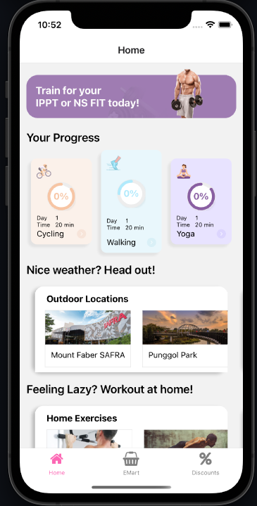

# My NS Buddy - By Team 26 Deniserocks

## Information
My NS Buddy aims to be the one-stop lifestyle app for NSMen and NSFs, to bring about greater convenience and flexibiltiy to their lives while keeping their fitness on track. 



# How to run the file

1. Download source
   ```bash 
   $ git clone https://github.com/karthikstar/codeexp_team26.git
   ```
3. Install Packages
   ```bash
    $ npm install
   ```
4. Test Run
   ```bash
    $ expo start
   ```
5. Open IOS Simulator / Web
    ```bash
      press i (for IOS Simulator) or w (for web)
    ```
   
Alternatively, you can download our Android APK at https://exp-shell-app-assets.s3.us-west-1.amazonaws.com/android/%40karthikstar/MyNsBuddy-f7eb979f242b47b6a93ac42e118779cc-signed.apk and try it out!

## Contributors
> Elangovan Karthikeyan [@karthikstar](https://github.com/karthikstar)<br>
> Denise Tay [@denisetay8](https://github.com/denisetay8)<br>
> Amabel Lim Hui Xin [@amabellim](https://github.com/amabellim)<br>
> Esther Teo Gek Wat [@estherteo](https://github.com/estherteo)
